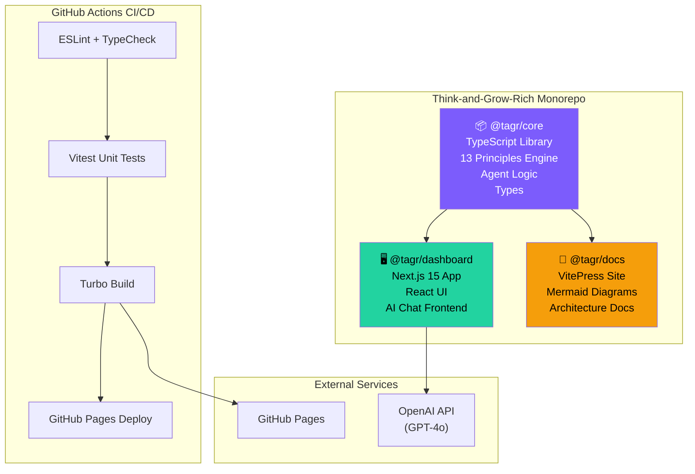
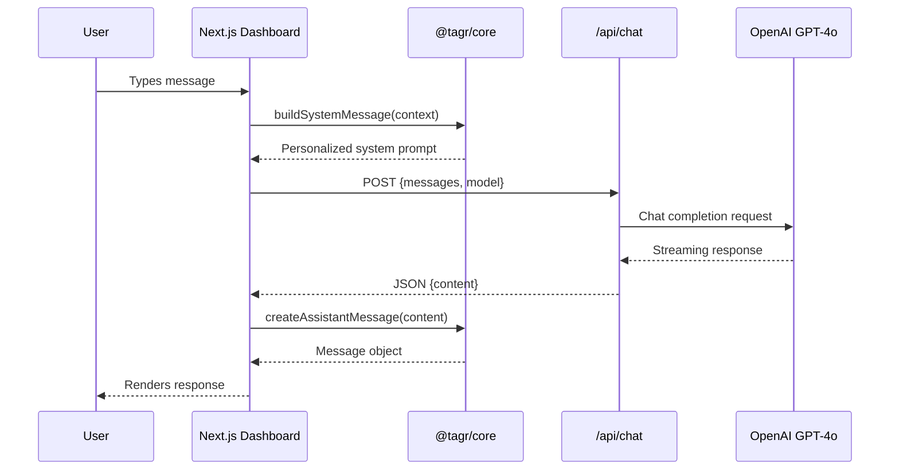

# Architecture Overview

The Think & Grow Rich project is built as a **pnpm monorepo** orchestrated by Turborepo, containing two applications and one shared package.

## High-Level System Diagram

## Data Flow: AI Chat

## Technology Stack

| Layer | Technology | Purpose |
|-------|-----------|---------|
| Monorepo | pnpm workspaces + Turborepo | Dependency management, build caching |
| Core Logic | TypeScript (ESM) | 13 Principles engine, type safety |
| Dashboard | Next.js 15 + React 19 | Interactive UI, static export |
| AI Chat | OpenAI API (GPT-4o) | Agentic mentor responses |
| Documentation | VitePress + Mermaid | Docs-as-code |
| Testing | Vitest | Unit tests for core package |
| CI/CD | GitHub Actions | Lint, test, build, deploy |
| Hosting | GitHub Pages | Static hosting |

## Build Pipeline

```mermaid
flowchart LR
    Push[Git Push] --> Trigger[CI Triggered]
    Trigger --> Checkout[Checkout Code]
    Checkout --> Install[pnpm install]
    Install --> Lint[pnpm lint]
    Lint --> Test[pnpm test]
    Test --> Build[pnpm build]
    Build --> DeployDocs[Deploy Docs → GitHub Pages]
    Build --> DeployDash[Deploy Dashboard → GitHub Pages]

    style Push fill:#2a2a3a
    style DeployDocs fill:#22d3a0,color:#000
    style DeployDash fill:#22d3a0,color:#000
```

