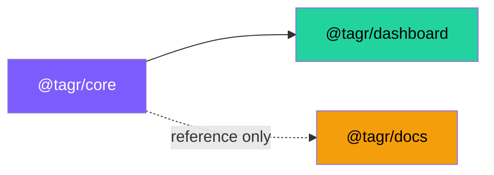

# Monorepo Structure

## Directory Layout

```
Think-and-Grow-Rich/
├── .github/
│   ├── ISSUE_TEMPLATE/
│   │   ├── bug_report.yml
│   │   ├── feature_request.yml
│   │   └── technical_debt.yml
│   └── workflows/
│       ├── ci.yml               # Lint + Test + Build
│       └── deploy-docs.yml      # GitHub Pages deployment
│
├── apps/
│   ├── dashboard/               # Next.js 15 AI Dashboard
│   │   ├── src/
│   │   │   ├── app/             # Next.js App Router
│   │   │   ├── components/      # React components
│   │   │   ├── hooks/           # Custom React hooks
│   │   │   └── lib/             # Constants and utilities
│   │   ├── next.config.ts
│   │   └── package.json
│   │
│   └── docs/                    # VitePress Documentation
│       ├── .vitepress/
│       │   └── config.ts
│       ├── principles/          # 13 Principle pages
│       ├── architecture/        # Architecture docs
│       ├── contributing/        # Contributor guides
│       └── index.md
│
├── packages/
│   └── core/                    # @tagr/core — Shared TypeScript library
│       ├── src/
│       │   ├── principles/      # 13 principles data + utilities
│       │   ├── agent/           # AI agent helpers
│       │   ├── types/           # TypeScript interfaces
│       │   └── __tests__/       # Vitest unit tests
│       ├── vitest.config.ts
│       └── package.json
│
├── scripts/
│   └── setup.sh                 # Interactive Getting Started script
│
├── package.json                 # Root workspace manifest
├── pnpm-workspace.yaml
├── turbo.json
├── tsconfig.base.json
└── README.md
```

## Package Dependency Graph



## Why pnpm + Turborepo?

| Feature | Benefit |
|---------|---------|
| pnpm workspaces | Shared `node_modules` hoisting, `workspace:*` protocol for local packages |
| Turborepo | Incremental builds, remote caching, parallel task execution |
| `tsconfig.base.json` | Consistent TypeScript settings across all packages |
