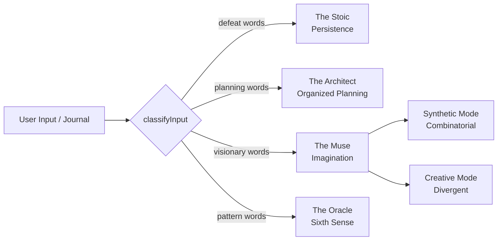

# TAGR 21st-Century OS

The "Operating System for the Mind" layer of `@tagr/core` is a small, pure-TypeScript implementation of the spec's behavioral, agentic, and analytics surfaces. It is intentionally framework-free so the same engine can drive the Next.js dashboard, future SwiftUI clients, and n8n workflow nodes.

## Modules

| Module | Source | Responsibility |
|---|---|---|
| `types/os` | `packages/core/src/types/os.ts` | Data shapes: `HillPrinciple`, `UserMasteryProfile`, `ChiefAim`, `ImaginationLog`, `PlannedTask`, `SentimentSample` |
| `mastery` | `packages/core/src/mastery/index.ts` | Vibrational Points (XP), `Apprentice → Builder → Master` rank, streak decay, consistency score, affirmation heatmap |
| `council` | `packages/core/src/council/index.ts` | The four-agent Council (Architect / Muse / Stoic / Oracle), Muse Synthetic vs Creative prompts, deterministic input classifier |
| `metrics` | `packages/core/src/metrics/index.ts` | Defeat-to-Pivot ratio, sentiment trend (60-day window, least-squares slope) |

## Council of Masterminds

`classifyInput` is a deterministic keyword router. It runs **before** any LLM call so routing is cheap, testable, and free of hallucination. A future LangGraph orchestrator can replace it without changing the public contract `(string → AgentRoute)`.

## Mastery Rank Progression

| Rank | Avg principle level across all 13 |
|---|---|
| Apprentice | 0 – 29 |
| Builder | 30 – 69 |
| Master | 70 – 100 |

Rank uses the **average** of all 13 principle levels — true to Hill's holistic "Master Builder" ideal where no single principle is allowed to dominate.

## Vibrational Points (XP)

| Action | Points |
|---|---|
| Recite daily auto-suggestion | 10 |
| Complete a Chief-Aim task | 25 |
| Attend a Mastermind session | 40 |
| Log a journal entry / reflection | 15 |
| Pivot after a Temporary Defeat | 30 |

XP → level uses `floor(log2(exp / 100 + 1)) + 1`, capped at 100. The logarithmic curve means each level costs more than the last, so high levels reflect sustained practice rather than burst activity.

## Out of Scope (for this monorepo)

The original spec describes a much wider ecosystem — n8n workflows, Apache Superset dashboards, Rocket.Chat federation, SwiftUI mobile clients, on-device LLM inference. Those live **outside** this repository. The `@tagr/core` package gives them a stable, typed contract to integrate against.
