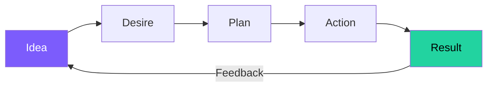

# 5. Imagination — The Workshop of the Mind

> *"Man's only limitation, within reason, lies in his development and use of his imagination."* — Napoleon Hill

## What It Is

Imagination is the workshop where all plans are fashioned. It is through imagination that man has given practical application to every new idea, product, and invention.

It operates in two distinct forms:

### Synthetic Imagination
Arranges existing concepts, ideas, plans, or facts into new combinations. It creates nothing — it works only with the material of experience, education, and observation.

### Creative Imagination
The faculty through which "hunches" and "inspirations" are received. It communicates directly with Infinite Intelligence, receiving new ideas and flashes of genius that synthetic imagination alone cannot produce.

## Key Insight

Ideas are the beginning of all achievement. A single well-nurtured idea, acted upon with persistence, can transform into an empire.

## The Four Steps

::: tip Action Steps
1. **Daily synthetic imagination practice**: Combine two existing ideas from different fields — force novel connections.
2. **Create a "dream space"**: 20 minutes of uninterrupted imaginative thinking each day — no phone, no noise.
3. **Capture every idea immediately**: Keep a notebook. The subconscious delivers on its own schedule.
4. **Develop creative imagination**: Through deep silence, meditation, and the practice of listening for inspiration.
:::

## The Idea-to-Empire Framework

## Edwin C. Barnes and the Imagination Principle

Barnes had no money, no connections, and no qualifications. But he had **the imagination to see himself as Edison's partner** — and the persistence to act on that vision. Imagination was the seed; all the other principles watered it.

## Daily Affirmation

*"My imagination is boundless. I see solutions where others see problems and opportunities where others see obstacles."*

## Related Principles

- [4. Specialized Knowledge](/principles/04-specialized-knowledge) — Raw material for synthetic imagination
- [6. Organized Planning](/principles/06-organized-planning) — Imagination's output must be organized into plans
- [13. The Sixth Sense](/principles/13-sixth-sense) — Creative imagination at its highest development
