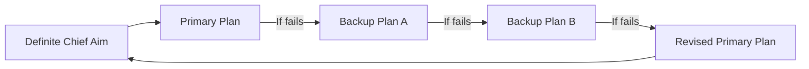

# 6. Organized Planning — The Crystallization of Desire into Action

> *"Plans are inert and useless, without sufficient power to translate them into action. If your first plan fails, replace it with another."* — Napoleon Hill

## What It Is

Organized planning is the bridge between desire and achievement. No one — regardless of talent, intelligence, or luck — ever accomplished anything of magnitude alone. The **Master Mind alliance** is the vehicle through which organized plans become reality.

## Key Insight

No individual has sufficient knowledge, energy, or skill alone to succeed greatly. Allied with others in a Master Mind, you access compound intelligence.

## The Five Steps

::: tip Action Steps
1. **Form your Master Mind**: Select five to seven allies whose skills complement your weaknesses and whose character you trust.
2. **Arrange regular meetings** with your Master Mind group for mutual encouragement and accountability.
3. **Create written, concrete plans** with specific milestones, deadlines, and assigned responsibilities.
4. **When a plan fails, replace it immediately** — temporary defeat is not permanent failure. Never abandon the goal, only the plan.
5. **Adopt the QQS standard**: Quality of service, Quantity of service, Spirit of service in all your work.
:::

## The QQS Formula

| Factor | Description |
|--------|-------------|
| **Q**uality | The highest quality you are capable of |
| **Q**uantity | The maximum quantity of service you can render |
| **S**pirit | Harmonious, pleasing conduct with all parties |

The person who renders more service than they are paid for — and does so in a spirit of harmony — cannot be permanently held back from success.

## Plan Types

## Daily Affirmation

*"I have a clear, written plan of action and a Master Mind alliance that accelerates my progress."*

## Related Principles

- [7. Decision](/principles/07-decision) — Plans require commitment
- [8. Persistence](/principles/08-persistence) — Plans require follow-through
- [9. Master Mind](/principles/09-master-mind) — The alliance that powers the plan
