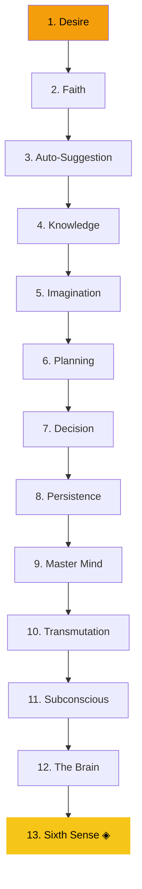

# 13. The Sixth Sense — The Door to the Temple of Wisdom

> *"The Sixth Sense is that portion of the subconscious mind which has been referred to as the Creative Imagination. It has also been referred to as the 'receiving set' through which ideas, plans, and thoughts flash into the mind."* — Napoleon Hill

## What It Is

The Sixth Sense is the apex of the philosophy — the cumulative reward of mastering all twelve preceding principles. It is the faculty through which Infinite Intelligence communicates voluntarily, without any effort from the individual, in the form of hunches, inspirations, and premonitions.

Hill states explicitly: this principle cannot be understood, or even successfully applied, without first internalizing the twelve principles that precede it.

## Key Insight

The Sixth Sense reveals itself only after years of applying all prior principles. It is the ultimate reward of a disciplined, purpose-driven mind.

## The Three Steps

::: tip Action Steps
1. **Master all twelve preceding principles** as the non-negotiable prerequisite for awakening the Sixth Sense.
2. **Cultivate daily silence, meditation, and reflection** — the Sixth Sense communicates in the still, small voice, not in the noise of a distracted mind.
3. **Act immediately on inspired hunches** before the rational mind has time to dismiss them as illogical.
:::

## The Path to the Sixth Sense

## The Council Chamber Practice

Hill described maintaining an imaginary council of nine historical figures — Lincoln, Napoleon, Carnegie, Edison, Darwin, Darwin, Paine, Lincoln, Muir, and others — with whom he would consult in his imagination before major decisions. Through this practice, he reported receiving guidance that proved uncannily accurate.

This is the Sixth Sense in practice.

## Daily Affirmation

*"I am connected to Infinite Intelligence. Inspired guidance flows to me freely and I act upon it with courage."*

## Related Principles

- [11. The Subconscious Mind](/principles/11-subconscious-mind) — The subconscious is the Sixth Sense's gateway
- [12. The Brain](/principles/12-the-brain) — Elevated brain activity enables reception
- [5. Imagination](/principles/05-imagination) — Creative imagination is the receiving mechanism
