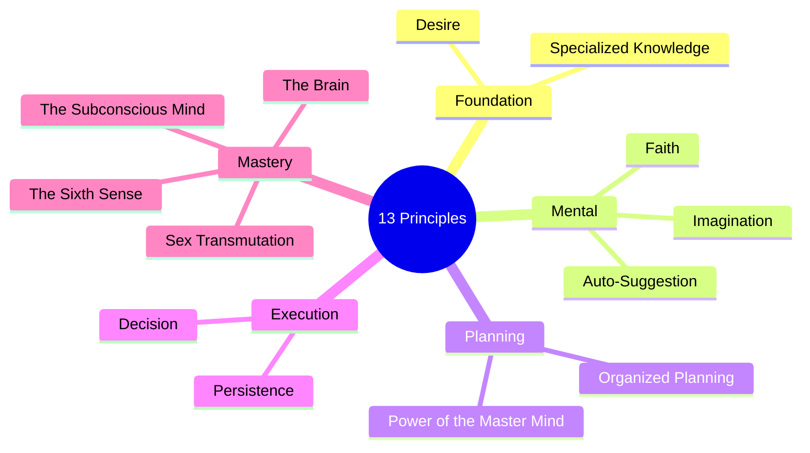
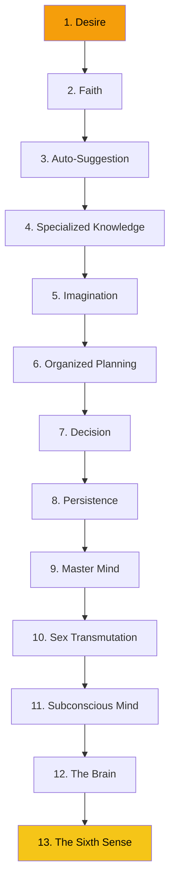

# The 13 Steps to Riches

The core of Napoleon Hill's philosophy is the sequential application of thirteen principles, each building upon the last. Together they form a complete system for transforming a desire into its physical or financial equivalent.

## How to Use This Guide

1. **Read each principle** in order — the sequence is intentional.
2. **Apply the action steps** before moving to the next principle.
3. **Track your mastery level** in the [Dashboard](https://dascient.github.io/Think-and-Grow-Rich/dashboard/) for each principle.
4. **Return to earlier principles** as your understanding deepens.

## The Five Categories

## Learning Sequence

## Principles at a Glance

| # | Name | Category | Key Insight |
|---|------|----------|-------------|
| 1 | [Desire](/principles/01-desire) | Foundation | A burning desire, not a wish |
| 2 | [Faith](/principles/02-faith) | Mental | Cultivated through repetition |
| 3 | [Auto-Suggestion](/principles/03-auto-suggestion) | Mental | Emotion amplifies subconscious instruction |
| 4 | [Specialized Knowledge](/principles/04-specialized-knowledge) | Foundation | Organized knowledge = power |
| 5 | [Imagination](/principles/05-imagination) | Mental | Synthetic + creative imagination |
| 6 | [Organized Planning](/principles/06-organized-planning) | Planning | Master Mind alliance |
| 7 | [Decision](/principles/07-decision) | Execution | Decide promptly, change slowly |
| 8 | [Persistence](/principles/08-persistence) | Execution | Three feet from gold |
| 9 | [Master Mind](/principles/09-master-mind) | Planning | Compound intelligence |
| 10 | [Sex Transmutation](/principles/10-sex-transmutation) | Mastery | Redirect creative energy |
| 11 | [Subconscious Mind](/principles/11-subconscious-mind) | Mastery | The connecting link |
| 12 | [The Brain](/principles/12-the-brain) | Mastery | Broadcasting station |
| 13 | [The Sixth Sense](/principles/13-sixth-sense) | Mastery | Door to Infinite Intelligence |
